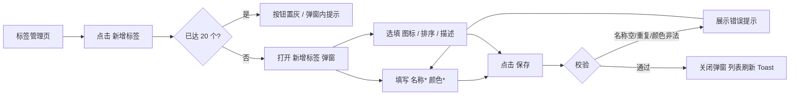
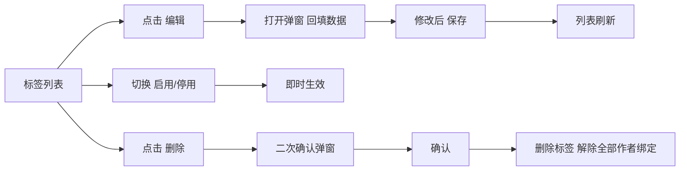
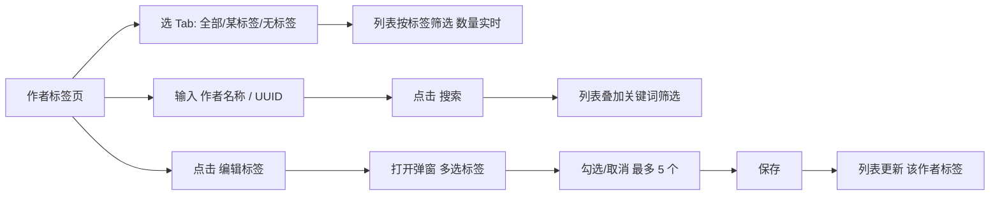
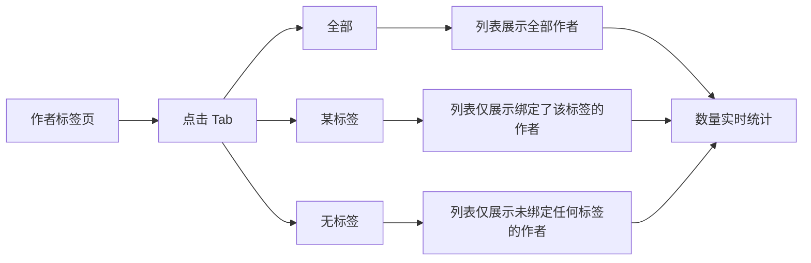
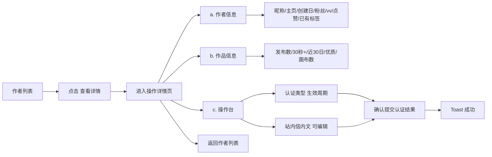

# LibTV 作者标签管理 — 交互原型图

> 可交互 Demo：[https://youzhaoyang.github.io/libtv-author-tag-admin/](https://youzhaoyang.github.io/libtv-author-tag-admin/)

---

## 一、整体结构

### 1.1 信息架构

```
运营后台
└── 作者标签
    ├── 标签管理          ← 标签池 CRUD、数量上限 20
    │   ├── 列表（搜索/状态筛选）
    │   ├── 新增标签（弹窗）
    │   ├── 编辑标签（弹窗）
    │   ├── 停用/启用
    │   └── 删除（二次确认）
    └── 作者标签          ← 按标签/关键词筛作者，给作者绑定标签
        ├── 标签 Tab 栏（全部 | 各标签 | 无标签，带数量）
        ├── 搜索区（作者名称、作者 UUID 平铺）
        ├── 作者列表（分页）→ 查看详情 / 编辑标签
        ├── 编辑标签（弹窗，多选标签，单作者上限 5）
        └── 操作详情页      ← 作者信息 + 作品信息 + 操作台（认证类型/周期/站内信）
```

### 1.2 页面与入口

| 页面 | 入口 | 说明 |
|------|------|------|
| 标签管理 | 侧栏「标签管理」 | 标签列表 + 新增按钮 |
| 作者标签 | 侧栏「作者标签」 | 作者列表 + 标签 Tab + 搜索 |

---

## 二、核心交互流程

### 2.1 新建标签



**弹窗线框图（新增标签）**

```
┌─────────────────────────────────────────────────────────┐
│  新增标签                                            ×  │
├─────────────────────────────────────────────────────────┤
│  * 标签名称                                              │
│  ┌─────────────────────────────────────────────────┐   │
│  │ 如：精选、官方认证                                 │   │
│  └─────────────────────────────────────────────────┘   │
│                                                         │
│  标签图标（选填）                                         │
│  [🏆][✓][🔥][⭐][💎]...[上传图标]  [🖼 预览] [×移除]     │
│  点击选择预设图标或上传自定义图标（PNG/SVG，≤50KB）        │
│                                                         │
│  * 标签颜色                                              │
│  [■][■][■][■]...  [#E53E3E] ■  预览：[■ 标签名称]       │
│                                                         │
│  排序权重  [4]  数值越小排序越靠前                        │
│  备注描述  [仅内部可见，备注标签用途________________]     │
├─────────────────────────────────────────────────────────┤
│                              [取消]  [保存]              │
└─────────────────────────────────────────────────────────┘
```

### 2.2 编辑标签 / 停用 / 删除



### 2.3 作者标签分配（按标签筛选 + 搜索 + 绑定）



**作者标签页线框图**

```
┌──────────────────────────────────────────────────────────────────────────┐
│  作者标签管理                                                             │
├──────────────────────────────────────────────────────────────────────────┤
│  [全部 8] [●精选 3] [●官方认证 3] [新锐创作者 3] [无标签 2]   ← Tab 带数量  │
├──────────────────────────────────────────────────────────────────────────┤
│  作者名称 [请输入作者名称____]  作者 UUID [请输入 UUID____]  [搜索] [重置]  │
├──────────────────────────────────────────────────────────────────────────┤
│  头像 │ 作者名称   │ UUID        │ 作品数 │ 已有标签      │ 操作          │
│  ●   │ 小飞侠赛事 │ a1b2c3d4... │  12   │ [精选][官认]  │ 编辑标签      │
│  ●   │ JOY堂多   │ e5f6g7h8... │   8   │ —             │ 编辑标签      │
├──────────────────────────────────────────────────────────────────────────┤
│  共 8 条                                    ‹  1  2  ›                   │
└──────────────────────────────────────────────────────────────────────────┘
```

**编辑作者标签弹窗线框图**

```
┌─────────────────────────────────────────────────────────┐
│  编辑标签 — 小飞侠赛事                                ×  │
├─────────────────────────────────────────────────────────┤
│  选择要绑定的标签（仅展示已启用）           已选 2 / 5    │
│  ┌─────────────────────────────────────────────────┐   │
│  │ ☑ ■ 精选                                        │   │
│  │ ☑ ■ 官方认证                                    │   │
│  │ ☐ ■ 新锐创作者                                  │   │
│  └─────────────────────────────────────────────────┘   │
├─────────────────────────────────────────────────────────┤
│                              [取消]  [保存]              │
└─────────────────────────────────────────────────────────┘
```

### 2.4 标签筛选（Tab + 数量）



### 2.5 操作详情页



**操作详情页线框图**

```
┌─────────────────────────────────────────────────────────────────┐
│  ← 返回作者列表                                                  │
├─────────────────────────────────────────────────────────────────┤
│  作者信息                                                        │
│  作者昵称    作者主页链接    创建账号日期    作者粉丝数    累计vv  │
│  小飞侠赛事  https://...    2024-06-15     12,580       89,200  │
│  累计获得点赞  已有标签                                            │
│  15,600      [精选][官方认证]                                     │
├─────────────────────────────────────────────────────────────────┤
│  作品信息                                                        │
│  累计发布(公开)  时长>30秒  近30日  优质作品  公开画布             │
│  12            8         3       5        2                      │
├─────────────────────────────────────────────────────────────────┤
│  操作台                                                          │
│  作者认证类型    [Level 1: LibTV 先锋作者 ▾]                      │
│  认证生效周期    [90天 ▾]                                         │
│  发布站内信      [站内信内文，空着可编辑________________]         │
│                 [确认提交认证结果]                                 │
└─────────────────────────────────────────────────────────────────┘
```

---

## 三、关键交互说明

| 场景 | 行为 | 反馈 |
|------|------|------|
| 新建标签 | 名称必填、唯一；颜色 HEX 合法；图标选填（预设 emoji 或上传图） | 校验失败红色文案；成功 Toast + 关弹窗 |
| 标签上限 | 系统标签数 ≥ 20 时「新增标签」置灰；弹窗内提示 | 无法新增，需先删/停用 |
| 作者标签上限 | 单作者最多勾选 5 个标签，超出禁用未选 | 提示「已达单作者标签上限」 |
| 标签 Tab | 点击即筛选，无需点搜索 | 列表与数量即时更新 |
| 搜索 | 作者名称、UUID 可同时填，与当前 Tab 叠加 | 点「搜索」后列表更新；「重置」清空关键词并恢复全部 |

---

## 四、原型文件与部署

| 项 | 说明 |
|----|------|
| 原型文件 | `index.html`（单页 React，Mock 数据） |
| 在线地址 | https://youzhaoyang.github.io/libtv-author-tag-admin/ |
| 仓库 | https://github.com/youzhaoyang/libtv-author-tag-admin |

部署方式：推送 `main` 分支后由 GitHub Pages（legacy）自动发布根目录静态资源。
